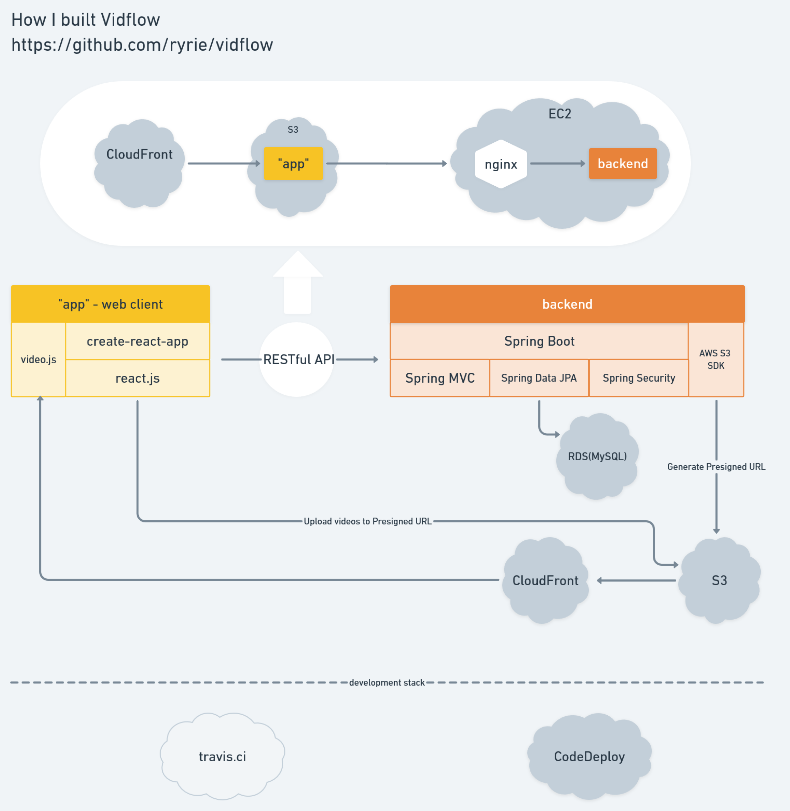

# Vidflow-web

demo : https://vidflow.ryrie.me

[Tiktok](https://www.tiktok.com)을 모티브로 한 mobile web application 입니다.

저의 개발 공부의 목적으로만 사용됩니다. 

## v2로의 이동
프로젝트의 개발 진행이 더뎌지는 이유는 별 기능이 없는데도 불구하고 프론트엔드의 코드가 통제 불가능할정도로 복잡해졌기 때문이다. 이 프로젝트를 진행하게 된지도 1년이 넘었고 그 사이에 생각이 많이 바뀌었다. 그런데 기존 코드를 유지하면서 새롭게 알게된 사실들을 적용하려고 하니 너무나도 제약이 많았다. 아래는 기능을 변경하기 어렵게 된 이유들이다.
- create-react-app은 처음 프론트엔드 개발을 이해하게 해준 아주 고마운 도구이지만, 뭔가 원하는 기능을 추가하기가 힘들게 되어있다. 어떤 라이브러리를 쓰기 위해서는 cra에서 사용하기 위한 설정을 또 해야 하거나, react-app-rewired같은 도구를 또 사용해야 한다. 이제는 바닥부터 내가 원하는 기능을 능동적으로 추가할 수 있을 것같은 자신감이 들었고, 그렇다고 cra를 eject하기도 싫다. 
- 처음부터 css를 난잡하게 구성하다보니 문제가 있어도 어디서부터 손보아야할지 모르겠다.
- 자바스크립트로 여러 라이브러리들을 사용하다보면 문서화도 제대로 안되어 있고 내가 제대로 사용 하고 있는건지도 모르는 상태가 많았다. 최근에 타입스크립트를 알게 되고 사용해 보면서 이런 문제점들을 줄여줄 수 있을 것이라는 생각이 들었다. 구성을 잘 한다면 일부분만 타입스크립트를 사용하면서 점진적으로 변화시킬 수는 었겠지만 그정도까지의 능력과 시간은 없다. 

v2 저장소 : 

### 사용한 프레임워크/라이브러리

Frontend : react.js(create-react-app)

Backend : Spring Boot [저장소 바로가기](https://github.com/ryrie/vidflow)

vidflow의 web frontend입니다. 

tiktok의 clone 프로젝트로 시작을 했기 때문에 동영상을 열람하는 방식이 swipe 입니다. 

mobile 모바일에서 접속을 권장하지만 desktop에서도 drag&drop 으로 동영상을 swipe할 수 있습니다.

브라우저에서는 기본적으로 페이지를 로드 하자마자 자동으로 동영상을 재생하는 것이 막혀 있습니다. 그래서 처음 들어가실 때에는 화면을 한번 터치 해야 재생이 됩니다.

https://whimsical.com/8GuyXPfT9u4WDGciFb2tZU

## 지금까지 개발된 기능들

- Home(영상 열람 페이지) 페이지
- 글쓰기(영상 편집 미지원)
- 댓글쓰기
- 팔로우
- 팔로우 한 사람의 글쓰기 알림, 좋아요 누름 알림
- 내용 검색, 유저 검색
- 회원가입 로그인
- 마이페이지, 다른 사람 정보 보기

## 프론트엔드 개발 특이사항

현재 위 기능까지 개발하면서 코드가 매우 지저분해졌고, 버그가 많아 기능을 더 추가하기가 힘들어졌습니다. 그래서 최근 추가된 React Hook과 Redux를 공부하여 redux branch에서 코드를 전면적으로 refactor하고 있습니다. hook을 적용하면서 느꼈던 것은 코드가 정말로 깔끔해져서 기분이 좋았고, redux 등의 flow를 유연하게 적용할 수 있어서 좋았습니다.
refactor가 완료되면 다시 다른 기능을 추가할 예정입니다.

## 개발하면서 했던 고민

### 로그인시 password를 암호화 해야 하며 어디서 해야 하는가?
물론 password는 backend에서 db에 암호화해서 저장을 하지만 사용자가 로그인할때 password를 암호화 해서 보내야 되지 않을까 라고 생각을 했다. 그렇지만 검색을 해보고, 실제 유명 웹 사이트들에서 디버깅 툴을 살펴본 결과 https가 적용 되었다면 frontend에서 암호화 하지 않아야 오히려 더 안전하다는 결론을 내렸다. 실제 많은 사이트들이 password를 그대로 보내고 있었다. 이런 점에서 봤을때 https는 선택이 아닌 필수다..

### 동영상 파일 처리는 어떻게 할 것인가?

프로젝트를 진행하는 동안 가장 많이 했던 고민입니다. 이 부분은 제가 이 프로젝트를 어디까지 만들 것인가에 따라 달라지는 문제입니다. 

1. RTSP 서버를 만들거나 기존 제품을 이용한다. RTSP 서버를 만드는 것 자체가 하나의 큰 프로젝트가 되어버리고, 기존의 RTSP 서버를 이용하기 위해서는 많은 비용을 지불해야 하며, 클라이언트에서도 RTSP를 따로 지원해야 하며 RTSP 프로토콜이 추가 됨에 따라 보안 설정등 애플리케이션이 훨씬 복잡해 질 것이라는 결론을 내렸습니다.
2. 그 뒤에 HTTP Live Steraming(HLS)을 알게 되었고, HLS는 기존의 HTTP를 그대로 사용하여 추가적인 보안설정등이 필요 없습니다. 그러나 이 프로젝트를 다시 생각해보면 짧은 동영상을 그냥 전달만 해주는 것이고, 실시간 스트리밍은 필요가 없다는 생각이 이때 들었습니다. 그래서 일단은 단순하게 static content delivery를 하는 것으로 결론을 내렸습니다.
3. 웹 소켓을 사용하여 파일을 업로드 하고, nginx로 static content delivery를 하려고 시도하였습니다. RAW Socket으로 개발을 하였으나(이상하게 일반적으로 사용되는 STOMP로는 잘 작동하지 않았습니다. STOMP도 binary data를 충분히 보낼 수 있는것으로 알고 있습니다.) api 서버가 파일 업로드를 직접 처리하는 것은 매우 큰 부담이 된다고 생각하며, content delivery에서 중요한 것은 결국 물리적 위치이며, 그 문제를 CDN이 해결할 수 있는 것을 알게 되었습니다. 그리고 AWS S3가 CDN의 역할을 할 수 있는 것을 알게 되었습니다.
4. 결국 S3에 파일을 올리는 것으로 방향을 바꾸었고 남은 문제는 어떻게 파일을 안전하게 올릴 수 있을까 라는 문제입니다. 웹 소켓의 경우 WSS 프로토콜을 사용하면 충분하지만, 사용자가 S3 스토리지에 안전하게 ACCESS 하기 위해서는 API 서버와 추가적인 작업이 필요했습니다. 알아본 결과 API서버가 스토리지에 AWS Credential을 이용하여 "presign" 하고 해당 링크를 사용자에게 전송하면 사용자는 그 링크에 PUT HTTP 요청으로 파일을 업로드할 수 있게 됩니다.

결국 남게 된건 저의 능력 부족으로 인한 핑계일 수도 있습니다만 여러 방법들에 대해 알수 있게 되었습니다. 

## 앞으로의 계획

- 처음에는 tiktok을 똑같이 만들어 보려고 억지로 끼워 맞추었던 적이 많았습니다. 그렇지만 이제는 그것을 벗어나 제가 만들어 보고 싶은 대로 만들 예정입니다.
- 편집 기능 추가 : 처음에는 영상 자르기라도 구현하려고 했으나 특정한 브라우저에서만 돌아가 결국 아무 기능도 구현하지 못했습니다. 좀 더 연구하여 추가할 예정입니다.

